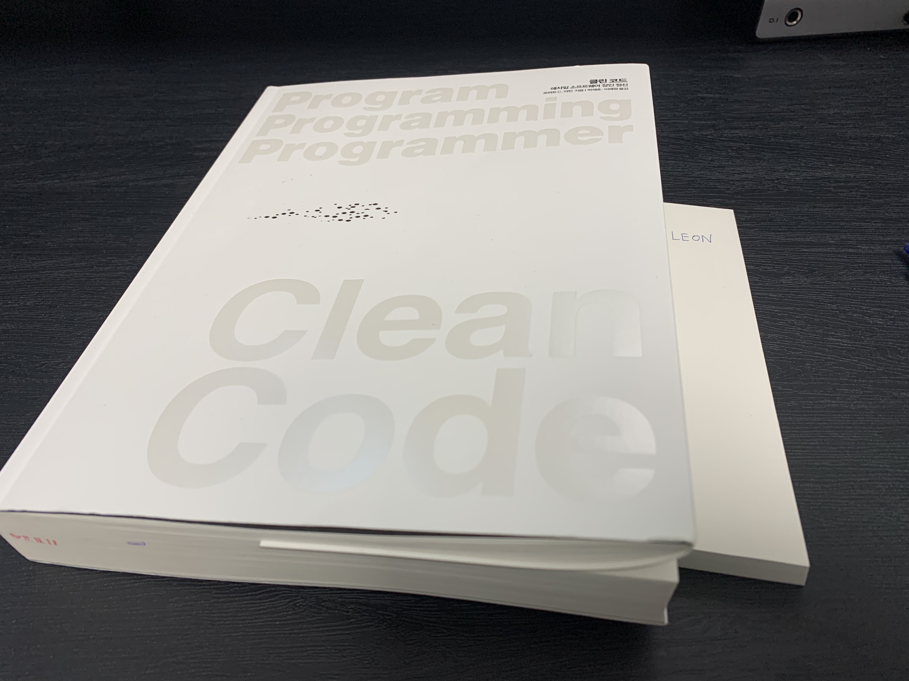

#노마드코더 #북클럽 #노개북

[노마드개발자북클럽](https://nomadcoders.oopy.io/)
[참여안내](https://nomadcoders.oopy.io/readme?utm_source=Nomad_Book_Club%231&utm_campaign=853979327e-EMAIL_CAMPAIGN_2022_01_20_09_04&utm_medium=email&utm_term=0_26f5b50d66-853979327e-357549384)
[TIL출석표](https://docs.google.com/spreadsheets/d/1Cy2NOnfFDP6Y1snkd3nL5VidLDmBq8C9696iTwbc_K0/edit#gid=0)

### 개요

- 노마드 개발자 북클럽 프로젝트의 일환으로 **Clean Code 책을 함께 완독하고 감상평**을 남기기로 했습니다!
- 스케쥴(1/21 ~ 2/20)에 따라 매일 책을 읽고 감상평을 남기는 형식입니다.
