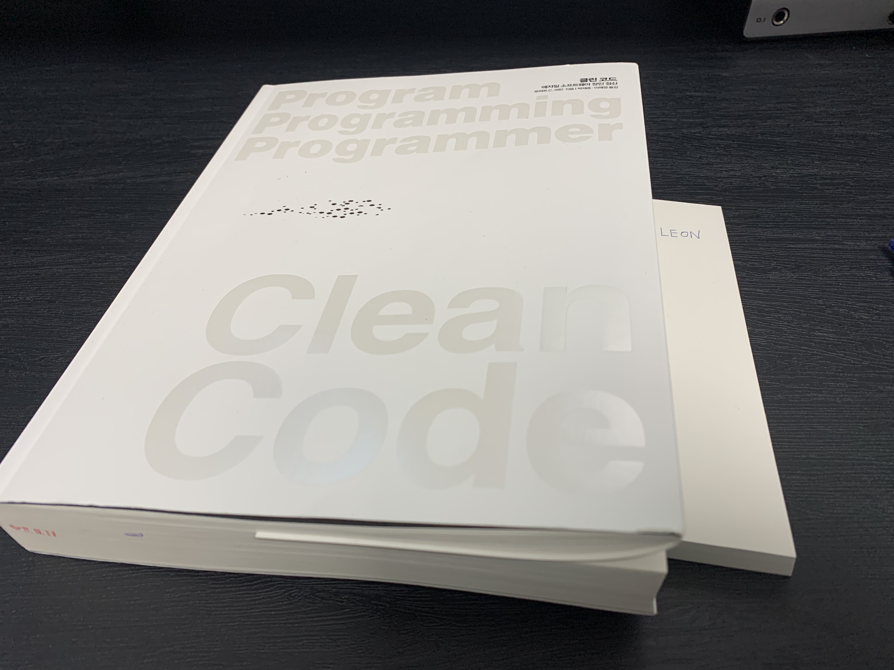

### 개요

- [노마드 개발자 북클럽](https://nomadcoders.oopy.io/) 프로젝트의 일환으로 **Clean Code 책을 함께 완독하고 감상평**을 남깁니다.
- 스케쥴(1/21 ~ 2/20)에 따라 매일 책을 읽고 감상평을 남깁니다.

### Table
- [DAY01 추천사](https://github.com/OnLee3/nomadbookclub/blob/main/TIL/DAY01%20%EC%B6%94%EC%B2%9C%EC%82%AC.md)
- [DAY02 깨끗한 코드](https://github.com/OnLee3/nomadbookclub/blob/main/TIL/DAY02%20%EA%B9%A8%EB%81%97%ED%95%9C%20%EC%BD%94%EB%93%9C.md)
- [DAY03 깨끗한 코드2](https://github.com/OnLee3/nomadbookclub/blob/main/TIL/DAY03%20%EA%B9%A8%EB%81%97%ED%95%9C%20%EC%BD%94%EB%93%9C2.md)
- [DAY04 의미있는 이름](https://github.com/OnLee3/nomadbookclub/blob/main/TIL/DAY04%20%EC%9D%98%EB%AF%B8%EC%9E%88%EB%8A%94%20%EC%9D%B4%EB%A6%84.md)
- [DAY05 의미있는 이름2](https://github.com/OnLee3/nomadbookclub/blob/main/TIL/DAY05%20%EC%9D%98%EB%AF%B8%EC%9E%88%EB%8A%94%20%EC%9D%B4%EB%A6%842.md)
- [DAY06 함수](https://github.com/OnLee3/nomadbookclub/blob/main/TIL/DAY06%20%ED%95%A8%EC%88%98.md)
- [DAY07 함수2](https://github.com/OnLee3/nomadbookclub/blob/main/TIL/DAY07%20%ED%95%A8%EC%88%982.md)
- [DAY08 주석](https://github.com/OnLee3/nomadbookclub/blob/main/TIL/DAY08%20%EC%A3%BC%EC%84%9D.md)
- [DAY09 주석2](https://github.com/OnLee3/nomadbookclub/blob/main/TIL/DAY09%20%EC%A3%BC%EC%84%9D2.md)
- [DAY10 형식 맞추기](https://github.com/OnLee3/nomadbookclub/blob/main/TIL/DAY10%20%ED%98%95%EC%8B%9D%20%EB%A7%9E%EC%B6%94%EA%B8%B0.md)
- [DAY12 객체와 자료구조](https://github.com/OnLee3/nomadbookclub/blob/main/TIL/DAY12%20%EA%B0%9D%EC%B2%B4%EC%99%80%20%EC%9E%90%EB%A3%8C%EA%B5%AC%EC%A1%B0.md)
- [DAY13 오류처리](https://github.com/OnLee3/nomadbookclub/blob/main/TIL/DAY13%20%EC%98%A4%EB%A5%98%EC%B2%98%EB%A6%AC.md)
- [DAY15 오류처리2](https://github.com/OnLee3/nomadbookclub/blob/main/TIL/DAY15%20%EC%98%A4%EB%A5%98%EC%B2%98%EB%A6%AC2.md)
- [DAY17 단위테스트](https://github.com/OnLee3/nomadbookclub/blob/main/TIL/DAY17%20%EB%8B%A8%EC%9C%84%ED%85%8C%EC%8A%A4%ED%8A%B8.md)
- [DAY18 단위테스트2](https://github.com/OnLee3/nomadbookclub/blob/main/TIL/DAY18%20%EB%8B%A8%EC%9C%84%ED%85%8C%EC%8A%A4%ED%8A%B82.md)
- [DAY20 클래스](https://github.com/OnLee3/nomadbookclub/blob/main/TIL/DAY20%20%ED%81%B4%EB%9E%98%EC%8A%A4.md)
- [DAY21 클래스2](https://github.com/OnLee3/nomadbookclub/blob/main/TIL/DAY21%20%ED%81%B4%EB%9E%98%EC%8A%A42.md)
